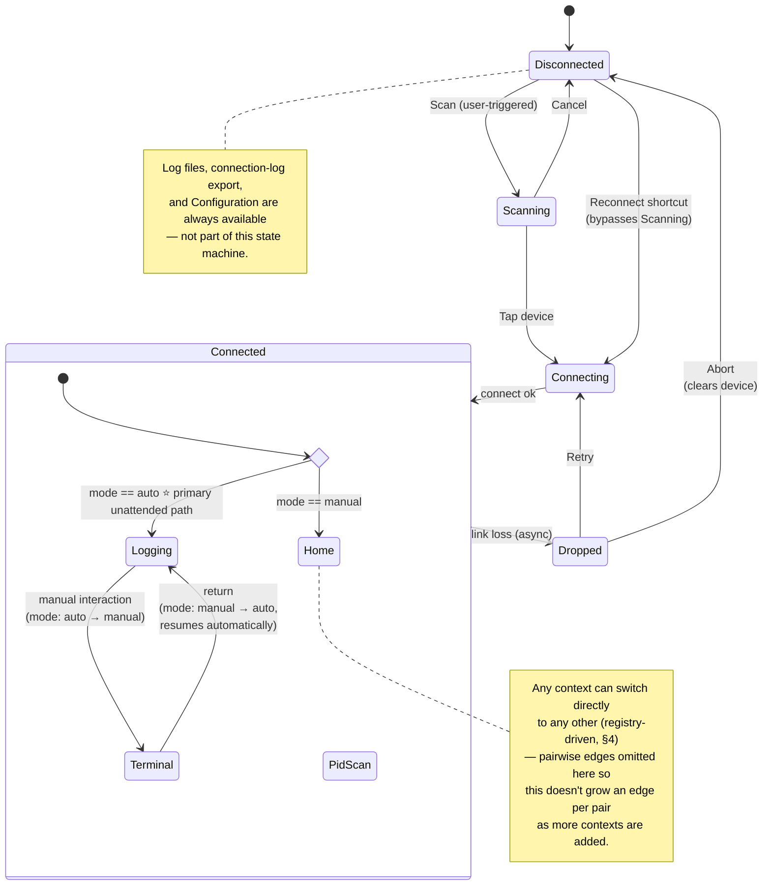

# Web UI Statefulness Design

**Status:** proposed
**Scope:** `esp32_obd2_logger` Web UI — connection state machine, route gating, dropped-link
handling, autologging, and configuration semantics.
**Related:** [`ARCHITECTURE.md`](../../ARCHITECTURE.md) (§ Extension points → Web UI)

This document is a design record, not a live reference — it captures the reasoning behind
the Web UI's statefulness model at the time it was written. Once implemented, the *current*
shape of the system belongs in `ARCHITECTURE.md`; this file stays as the "why" behind it.
If the design changes materially, prefer a superseding doc over rewriting this one in place.

---

## 1. Design principles established

- **One state machine is the single source of truth**, living in firmware — not inferred
  separately by each browser tab.
- **Server-side gating, not just UI hiding.** Routes reject requests invalid for the current
  state (409), independent of whatever the browser happens to show.
- **Runtime state vs. persisted config stay separate.** Nothing writes to persisted
  configuration as a side effect of navigation or view rendering — only deliberate actions
  in the `Configuration` context do.
- **Interpretation/visualization happens offline.** The ESP32 captures and serves raw
  structured data (CSV exports); charting, correlation, and analysis live in existing
  offline tooling (HTML cell analyzer, matplotlib scripts) — not on-device.
- **A fresh BLE scan is always user-triggered.** No auto-scan on boot or page load.

---

## 2. State machine



Five states:

| State | Description |
|---|---|
| `DISCONNECTED` | No BLE link. Shows **reconnect shortcut** to last-known device (primary action) and **scan** (secondary action). |
| `SCANNING` | BLE discovery active. Device list populates live as supported dongles are found (`scanning: bool` flag, not a separate state from "device list"). Tapping a row connects directly. Cancel returns to `DISCONNECTED`. |
| `CONNECTING` | `/connect` in flight. Guarded against duplicate calls (see §3). |
| `CONNECTED` | Active BLE session. Carries a `ConnectedContext` (see §4). |
| `DROPPED` | Link lost while connected. Requires explicit user action (Retry or Abort) — no auto-retry in manual mode. Device selection and context are preserved so Retry can resume where it left off. |

**Reconnect shortcut**: `DISCONNECTED → CONNECTING` directly, bypassing `SCANNING`, using a
persisted last-known-device address. Uses the same guarded connect path as a scan-based
connect (§3) — same function, different caller/address source.

### `/api/status` shape

```json
{
  "state": "connected",
  "mode": "manual",
  "context": "terminal",
  "device": { "addr": "AA:BB:...", "name": "LELink" },
  "reason": null
}
```

---

## 3. Guarding against duplicate `/connect` calls

Single compare-and-swap check in firmware — no session tokens needed since the web server
serializes on one task:

```cpp
bool tryStartConnect(const char* addr) {
  if (uiState != UiState::DEVICE_LIST_OR_SCANNING && uiState != UiState::DROPPED
      && uiState != UiState::DISCONNECTED /* reconnect shortcut */) {
    return false; // already connecting/connected — reject
  }
  uiState = UiState::CONNECTING;
  selectedDevice = addr;
  return true;
}
```

`/connect` returns `409 Conflict` immediately if the guard fails, before touching the BLE
stack. A second tab's stale request never reaches the radio; its next `/api/status` poll
shows the real state and it self-corrects.

---

## 4. `ConnectedContext` — table-driven registry

Extensible, not a hardcoded switch:

```cpp
struct ContextDef { const char* name; const char* routePrefix; };
constexpr ContextDef kContexts[] = {
  {"home",     "/home"},       // manual-mode landing page; vehicle info (VIN, etc.)
  {"terminal", "/terminal"},
  {"pid_scan", "/pid-scan"},   // future
  {"logging",  "/auto-log"},   // autologging readout
};
```

Route gating: `state == CONNECTED && context matches route's registry entry`. Adding a new
context is one table entry plus its own routes — no change to the gating logic itself.

**`Home` is the manual-mode entry point.** On entering `CONNECTED`, a choice on `mode`
decides where the session lands: `manual → Home`, `auto → Logging` (§6). From there, any
context can switch directly to any other — this is **implicit, registry-driven navigation**
(§4's table), not something requiring an explicit edge per pair. As more contexts get added
(`pid_scan` and beyond), this stays a flat "pick any registered context" operation rather
than an ever-growing set of pairwise transitions to wire up and diagram.

The one exception is `Logging ↔ Terminal`, which is drawn explicitly because it isn't *just*
navigation — leaving `Logging` has the side effect of pausing autologging polling, and
returning to it resumes automatically (§6). That behavioral asymmetry is worth keeping
visible; plain context switching elsewhere is not.

`Home` shows vehicle identity info (VIN, etc.) — planned in two phases:
1. **Manual fetch**: a button triggers a one-off query, result shown until the session ends.
2. **Automatic fetch on entry**, once the query is proven reliable enough to run unprompted.

Importantly, **`Home` shares the same single BLE command channel as every other context.**
A VIN fetch (manual or, later, automatic-on-entry) contends for that channel exactly like a
Terminal command does. This mostly matters at the boundary with autologging: if a `Home`
visit is reachable from an active `Logging` session (e.g. checking in mid-drive), it needs
the same pause/resume treatment as `Terminal` does (§6) — `Home` isn't a "free" context just
because it feels like a passive landing page.

**Terminal session survives page reload.** State lives server-side; on load the client
fetches `/api/status`, sees `connected/terminal`, and re-renders that view directly. For
scrollback, replay the existing bounded `obd_log` ring buffer (32 entries is small enough
to just replay in full; add a `sessionStartSeq` marker later only if stale-session log
bleed becomes a real problem in practice).

---

## 5. Dropped-link handling

### Reason taxonomy (logged, not necessarily all shown verbatim in UI)

| Code | Meaning |
|---|---|
| `link_supervision_timeout` | Radio-level — likely range/interference |
| `peripheral_initiated` | Dongle disconnected (power loss, dongle-side reset) |
| `local_stack_error` | ESP32 BLE stack fault, not a real link problem |
| `auth_failure` | Pairing/auth renegotiation failed |
| `unknown` | Catch-all |

### `Dropped` card contents

- Device name + address (same one Retry will target)
- Context active at time of drop (e.g. "was in Terminal")
- Reason, in plain language (raw code kept in status/logs, not shown verbatim)
- Time since drop ("Lost 12s ago")
- Data safety readout: how much was captured before the drop (e.g. session duration / row count)
- **Retry** (primary) and **Abort** (secondary, visually separated) — no auto-retry timer/countdown in manual mode

### Persistent connection-events log (separate from the OBD data log)

Row per drop event, exportable as CSV (`/connection-log.csv`, always-available/ungated,
same convention as `/raw-log.csv`):

```
timestamp,device_addr,device_name,reason_code,session_duration_s,context_at_drop,retry_outcome
```

`retry_outcome` (success / failed / user-aborted) turns each drop into a resolvable event —
also the dataset for tuning autologging retry/backoff values later (§6).

---

## 6. Autologging (`mode: auto`)

Second entry path into the **same** state machine, not a parallel one. A `mode` field
(`manual` | `auto`) travels with the session and changes *policy*, not structure.

- **Trigger**: on boot, if `autologging_enabled` (persisted config) is set, firmware
  attempts connect to the last-known device automatically — no user interaction.
- **On success**: enters `CONNECTED` with `context = logging` automatically (registry
  entry, §4). This is a passive readout context — elapsed time, rows written, last
  SOC/pack voltage — not interactive, consistent with "interpretation happens offline."
- **On `DROPPED` while `mode == auto`**: auto-retries using persisted, tunable backoff
  (`retry_interval_s`, `max_retries` / `give_up_after_s`). After giving up, returns to
  `DISCONNECTED` and stays idle until next boot (no indefinite parked retry loop).
- **Manual abort of an auto session** presents two distinct choices, not one:
  - "Abort this session" — retries again next power-up (flag untouched)
  - "Abort & disable auto-logging" — clears `autologging_enabled` (persists until user
    re-enables it via `Configuration`)
- **`AUTO` badge** in persistent UI chrome whenever `mode == auto`, so a user checking in
  always knows at a glance whether they're looking at something the system started itself.

### Manual interaction during an active auto session

- BLE is a single request/response channel — switching to `terminal` (or `home`, if reached
  from an active `logging` session) **pauses** logging polling; none of them can run
  concurrently with it. UI should say so explicitly before switching ("Entering Terminal
  will pause automatic logging").
- **This is now a real `mode` transition, not just a pause.** The moment a human switches
  away from `logging`, the runtime `mode` field flips `auto → manual` — `/api/status` and
  the `AUTO` badge should honestly reflect that a person is actively driving the session,
  not silently stay "auto" underneath a paused view.
- **This is separate from `autologging_enabled`** (§7's persisted config). The mode flip is
  a live, in-session signal; the persisted flag is what decides whether autologging is even
  attempted on the *next* boot. Touching `terminal` mid-drive does not disable autologging
  going forward — only the explicit "Abort & disable auto-logging" action does that.
- **Open question, not yet resolved:** does returning to `logging` flip `mode` back to
  `auto` symmetrically (matching the existing "resume is automatic" behavior), or does the
  session stay `manual` for the rest of this boot once a human has touched it, only
  re-arming on the next power cycle? The diagram currently assumes the symmetric version —
  worth confirming, since it changes whether checking in mid-drive is a harmless glance or
  something that quietly demotes the rest of the drive to manual.

---

## 7. Configuration — dedicated, ungated context

Single write path for everything persisted, rather than scattering controls across other
contexts. Sits in the **always-available** bucket (same as log files / connection-log
export) since these need to be settable before ever connecting.

```
Connection-gated (state == CONNECTED + matching context): terminal, pid_scan, logging (readout)
Always-available (no uiState dependency): log files, connection-log export, configuration
```

**Owns:**
```
autologging_enabled: bool
retry_interval_s: int
max_retries: int   (or give_up_after_s: int)
```

**Multiple explicit entry points are fine** (a deep link from the `logging` readout, the
abort dialog's disable shortcut) — what must stay singular is the *write path*: nothing
mutates these values as a passive side effect of a view rendering, only deliberate actions
routed through the same underlying write.

**Changes take effect on next boot, not live:**
- Config is read once at boot (autologging check) — no live-reload path needed, consistent
  with how the rest of the persisted config is already handled.
- UI must say so explicitly on save ("Saved. Takes effect on next power-up"), and should
  distinguish **active this session** vs. **pending from last save** if a user reopens
  `Configuration` mid-session after editing.
- Tuning workflow: adjust → power-cycle → observe via connection-events log → repeat.
  Slower feedback than live tuning, acceptable since this is dialed in occasionally, not
  iterated every session.

---

## 8. Framework / transport recommendations

- **Alpine.js**, bundled locally into flash/SPIFFS/LittleFS (gzip'd, ~15KB) rather than
  loaded from a CDN at runtime — the device likely has no WAN access in the field (car-side
  AP or hotspot join), so a CDN dependency risks a broken UI. Pairs naturally with a JSON
  `/api/status` endpoint: `x-show`/`x-if` toggle sections based on `state`/`mode`/`context`.
- **Server-Sent Events** (`/events`) over WebSockets for push updates (terminal output,
  async drop detection) — cheaper on ESP32, one persistent HTTP response instead of a
  separate protocol handshake.
- Single shell page (`/`) rather than separate top-level pages per concern; client renders
  whichever section matches current `/api/status`.

---

## 9. Open questions still outstanding

- Exact reason-code set may need to grow as more BLE stack callback variants are observed
  in practice — `unknown` as catch-all covers this for now.
- Whether `logging` context needs any config surfaced inline (vs. purely a readout with a
  deep link to `Configuration`) — leaning toward pure readout, not yet finalized.
- Default values for `retry_interval_s` / `max_retries` — intentionally left as tunables to
  be dialed in empirically against the connection-events log, no defaults chosen yet.
- What "proven reliable enough" means for promoting VIN fetch from manual-button to
  automatic-on-entry — needs some criteria (e.g. N consecutive successful manual fetches)
  rather than being a judgment call made once and forgotten.
